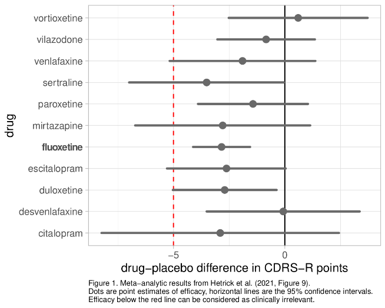
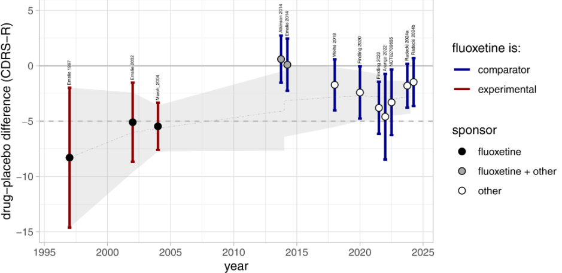
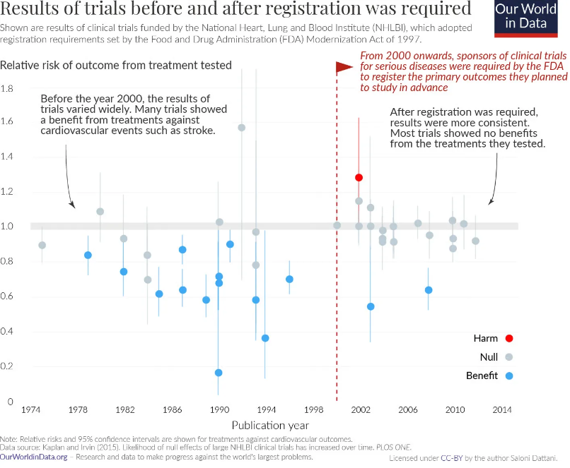
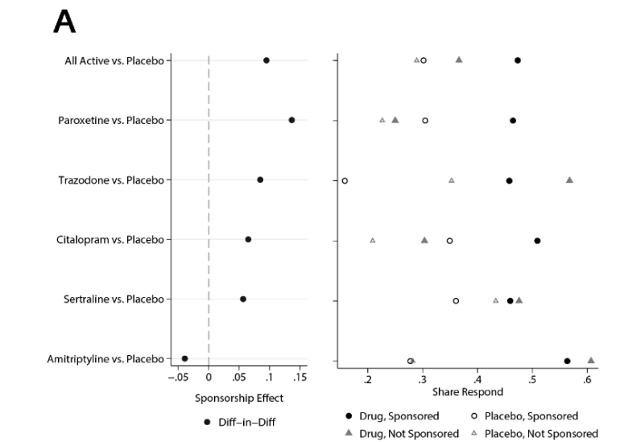
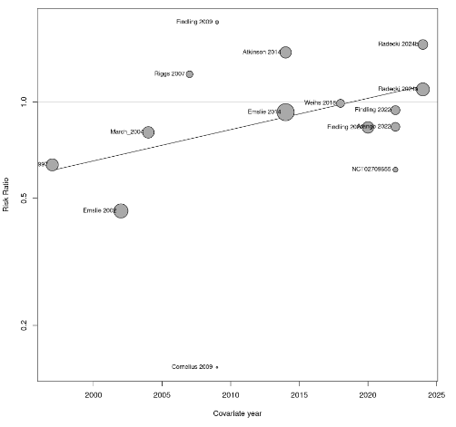
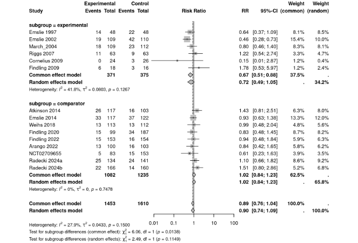

# Necessary but still unacknowledged lessons from pediatric fluoxetine trials

Currently, fluoxetine is recommended as a first-line antidepressant to treat pediatric depression in guidelines from major medical organizations. Consequently, fluoxetine has become one of the most widely prescribed antidepressants in children and adolescents.

However, according to the results of clinical trials, fluoxetine has lost its previously clinically meaningful efficacy and can now be considered to be clinically equivalent to placebo. While this may seem puzzling, I will provide explanations and argue that important lessons can be learned from this observed decline in efficacy related to biases in research. Moreover, the implications are crucial in judging the efficacy of other antidepressants such as sertraline or escitalopram, which are increasingly used but far less investigated than fluoxetine. In current guidelines and the literature, neither the loss of efficacy for fluoxetine has been adequately acknowledged, nor the important implications for other antidepressants. Consequently, current treatment recommendations and clinical practices likely still rest on an uncorrected and uncritical interpretation of the evidence. This can potentially harm young depressed patients.

# Fluoxetine’s loss of efficacy

According to two influential systematic reviews and network meta analyses (NMA) of randomized controlled trials (RCTs) published in 2016 by Cipriani et al. in “The Lancet” \[1\] and in 2020 by Zhou et al. in “Lancet Psychiatry” \[2\], fluoxetine was the only antidepressant that showed statistically significant superiority to placebo. Cipriani et al. reported in their abstract that

“*For efficacy, only fluoxetine was statistically significantly more effective than placebo (standardised mean difference –0·51, 95% credible interval \[CrI\] –0·99 to –0·03)*” and concluded that “*When considering the risk–benefit profile of antidepressants in the acute treatment of major depressive disorder, these drugs do not seem to offer a clear advantage for children and adolescents. Fluoxetine is probably the best option to consider when a pharmacological treatment is indicated*.” Later, Zhou et al. found nearly identical findings for fluoxetine, with a slightly tighter credible interval[^index-1] (*–0·51, 95% credible interval \[CrI\] –0·84 to –0·18)*.”

[^index-1]: A credible interval quantifies imprecision in Bayesian statistics, and it can be interpreted as: given the observed data and some prior assumption about the distribution of the effect, the true effect lies within this interval with 95% certainty. In frequentist statistics imprecision is often quantified with the 95%-confidence interval, which has a far less intuitive interpretation, but often has very similar results as with the Bayesian analysis.

Based on these findings, major guidelines from the US, Canada, and the UK recommend fluoxetine as the first-line antidepressant to treat pediatric depression \[3\]. In 2021, a NMA conducted by Hetrick et al. and published by the prestigious Cochrane collaboration \[4\] revealed surprising results. The efficacy of fluoxetine was now only about half, with a tight confidence interval (CI): SMD = -0.20 (95% CI -0.28 to -0.11). Moreover, this efficacy finding was now rated with “moderate certainty” in contrast to the earlier two NMAs which rated the evidence with “low certainty”. Furthermore, the efficacy of fluoxetine was now fully below the prespecified criterion of clinical equivalence with placebo, which was 5 points on the “Children’s Childhood Depression Rating Scale Revised” (CDRS-R). The efficacy in terms of CDRS-R was only -2.8 (-4.12 to -1.56) points difference between fluoxetine and placebo (Fig. 1). Consequently, the Cochrane review concluded that

“*most newer antidepressants may be associated with small and unimportant reductions in depression symptoms compared with placebo, which raises the question of whether they should be used at all*.”

Interestingly, the Cochrane authors did not discuss the loss of efficacy at all, despite the fact that some authors were involved in the earlier NMAs, too. Furthermore, whenever I came across a new paper on treatment recommendations or new guidelines, fluoxetine’s loss of efficacy was not discussed, except for the very recent German guidelines appearing at the end of 2025 (with a very problematic interpretation of the evidence, see below). I repeatedly pointed this out on X and [Bluesky](https://bsky.app/search?q=from%3Ame+fluoxetine+efficacy). How can it be possible that such a crucial finding did not cause more discussion? More importantly, why was there no necessary correction of treatment recommendations? Finally, after Richard Lyus, a child and adolescent psychiatrist from the UK, reached out to me with similar concerns, we started to do some research on why efficacy declined into the range of clinical unimportance. Fortunately, we could get experts in the field for cooperation (Joanna Moncrieff, Florian Naudet, Mark Horowitz) and also an expert in Bayesian NMA (Gert vanValkenhoef). I am very thankful for cooperating with these experts.

## Our meta-analysis confirmed the loss of fluoxetine’s efficacy

Our initial hypothesis regarding why fluoxetine lost its efficacy was that maybe there were weaker effects in more recent trials. This phenomenon is known as “novelty bias” in evidence based medicine which I will discuss further below. Therefore, we conducted and published our own meta-analysis of all available trial reports comparing fluoxetine with placebo \[3\]. We also included trials that were published after the Cochrane meta-analysis. In Figure 2, taken from our publication, it can be seen that the efficacy of fluoxetine was larger in earlier trials compared to later trials.

**Figure 2.** Efficacy of fluoxetine over time. The figure is taken from our publication \[3\]. Error-bars correspond to the 95% confidence interval (CI). The dot-dashed gray line is the result of the meta-analytic aggregation of the studies over time, together with the 95% CI-Band shaded in gray. The horizontal dashed gray line is the threshold of clinical significance.

The results indicate that the efficacy of fluoxetine stabilized around 2014, with a point estimate of approximately 2.5 CDRS-R points. The addition of new trials did not change this estimate much; it only narrowed the confidence interval. Therefore, the small efficacy should have already emerged in the NMA by Cipriani et al., and more so in Zhou et al.'s NMA. Consequently, the inclusion of more recent trials cannot account for the conflicting findings between the earlier meta-analysis by Cipriani/Zhou and the Cochrane meta-analysis by Hetrick. An additional explanation was needed.

## Searching for further explanations and finding a zombie

We then delved deeper into the three NMAs to uncover explanations for the conflicting findings. We discovered that both Cipriani et al. and Zhou et al. included a small trial where fluoxetine was compared with nortriptyline, showing an impossibly large effect size (SMD \> 4). Such effects are simply not plausible in evidence based medicine. Effects with SMD \> 1 are already exceptional in psychiatry \[5\] and SMDs of approximately 0.3 are typical in antidepressant research. We also identified obvious statistical inconsistencies in this trial publication, suggesting that the findings are erroneous. There were additional concerns with this study that cast doubts on its trustworthiness, leading us to suspect that this trial is a so-called “[zombie-trial](https://restores.univ-rennes.fr/zombie-trials)” . Zombie trials are “randomised controlled trials that appear to be false and those where the data lack credibility so blatantly that they can be called ‘zombies’”\[6\]. In any case, this study was clearly an outlier and Cochrane recommends running sensitivity analysis without including outlying studies. This was not done by Cipriani et al. and Zhou et al., however. Moreover, as we found out, it was this zombie study that created so called “inconsistencies” between direct and indirect evidence in their NMAs. This inconsistency was acknowledged by the authors and was one reason why the certainty ratings of evidence were downgraded. However, Cipriani et al. and Zhou et al. did not detect that it was this single study that caused the inconsistency and they also did not find the obvious discrepancies and errors in this study.

In the next step, we aimed to reproduce the meta-analyses, both with and without the inclusion of the zombie trial. We found that, after removing the outlier zombie trial, the efficacy of fluoxetine substantially decreased to SMD -0.26 (-0.43 to -0.09) in Cipriani et al. and -0.29 (-0.50 to -0.07) in Zhou et al., which was then comparable to the results from our re-analysis of the Cochrane meta-analysis at -0.27 (-0.38 to -0.15). Furthermore, after excluding the zombie, all inconsistencies between direct and indirect evidence within the meta-analyses by Cipriani/Zhou disappeared. This demonstrates that even one small problematic trial can substantially impact overall efficacy estimations and that even experts in meta-analyses can overlook a problematic trial.

It is often said that science is self-correcting and one might expect that there would be interest in publishing our re-analysis. Fortunately, the editors of the Lancet journals were interested and offered us to submit our concerns as a full paper. However, it was then rejected after having been peer-reviewed, and the case was considered closed. Our manuscript was subsequently desk-rejected in four other journals. A preprint is available \[7\] and our paper was then accepted in August 2026 by *Cochrane Evidence Synthesis and Methods*. A science journalist contacted us and Cipriani for a comment. Cipriani’s response was almost similar to reviewer #2’s response to our submission to the Lancet, and it is very likely that he was one of the anonymous reviewers who rejected our submission.

# Why can a treatment lose its efficacy?

Our meta-analysis revealed that efficacy estimates decayed over time even in analyses not impacted by the zombie trial (Fig. 2). While the earlier trials on fluoxetine reported a drug-placebo difference of more than 5 points on the CDRS-R, later trials found only a difference of approximately 2.5 points. Why can this be so?

This decline in efficacy estimates is not unique to fluoxetine but is a well-known and widespread phenomenon in evidence-based medicine, often referred to as “novelty bias.” Several methodological biases and problematic research practices have been identified as responsible for creating the novelty bias.

## Preregistration, reporting bias, and outcome switching

First and foremost, earlier trials were conducted in an era where the registration and reporting of trials were not mandatory, making research practices less transparent and increasing the room for problematic research practices. Since 2008, the [Helsinki Declaration](https://www.wma.net/wp-content/uploads/2018/07/DoH-Oct2008.pdf) has required that “Every clinical trial must be registered in a publicly accessible database before recruitment of the first subject.” The [FDA](https://www.fda.gov/regulatory-information/selected-amendments-fdc-act/food-and-drug-administration-amendments-act-fdaaa-2007) made a similar demand in 2007 and also required that study results be reported in the trial register. This prevents the study methodology and data-analysis from being changed post-hoc in order to end up with more convenient results. Although this still happens, it can then be detected and used to downgrade certainty ratings. Furthermore, pre-registration also prevents studies with inconvenient results from remaining unpublished or unnoticed.

The dramatic impact of the mandatory earlier requirement to register trials for serious diseases by the FDA already in 2000 can be seen in Figure 3 for trials funded by the National Heart, Lung, and Blood Institute. Before mandatory registration, most of the published research findings were positive, while afterwards positive trials were exceptional.

**Figure 3.** Taken from <https://www.clinicaltrialsabundance.blog/p/clinical-trial-reforms-that-once>

This has also been convincingly demonstrated in antidepressant research. A highly cited review from 2008 reported that almost none of the negative trials (without a significant drug-placebo difference) were published \[8\]. Furthermore, many trials in which the planned primary outcome was negative were transformed into positive ones by switching from the negative primary outcome to a positive secondary outcome \[9\]. After mandatory registration and reporting, the problem has substantially improved but the situation is far from perfect. For example, still only about half of the negative trials about antidepressants approved between December 1987 and August 2002 were published \[10\]. Consequently, reviews that rely on published trials miss all those unpublished studies which are often negative. Since registration reduced this reporting bias, more and more negative studies come to light, leading to a drop in efficacy from the time before registration to the time afterwards. This likely applies to the database on pediatric antidepressants as well. Indeed, the first pediatric fluoxetine trial conducted by Eli Lilly \[11\] from 1986 was negative and never published.

## Sponsorship Bias

Another important potential mechanism that can explain the decay of efficacy estimates is sponsorship bias. When a new drug is introduced, trials are usually conducted and sponsored by the manufacturer of the drug. For example, Eli Lilly, the manufacturer of fluoxetine, sponsored the two early published trials from 1997 and 2002 \[12,13\]. Neither of the two trials were pre-registered in a public trial register because this was not available at that time. A third early trial was the famous Treatment of Adolescent Depression (TADS) trial, which was publicly funded by the National Institute of Mental Health (NIH). Nonetheless, 8 of the 11 authors had financial ties to Eli Lilly and this study can hardly be considered independent. This is confirmed by a recent independent analysis of the data which found evidence for biased reporting of adverse events for fluoxetine \[14\]. All three early published trials reported positive results for fluoxetine, with point estimates exceeding Hetrick et al.’s threshold of clinical significance of 5 CDRS-R points (see Fig. 2). Later trials were mostly conducted by competing companies with fluoxetine being used as an established comparator drug in an additional arm in the trial. For example, one [recent trial](https://clinicaltrials.gov/study/NCT02709746) used 4 arms: vortioxetine 10mg, vortioxetine 20mg, fluoxetine 20mg, and placebo. In none of these trials did the point-size efficacy estimate of fluoxetine versus placebo cross the threshold of clinical significance. In the majority of trials, fluoxetine was not even statistically significantly superior to placebo.

There may be several mechanisms underlying the sponsorship bias in general and for fluoxetine trials specifically. Sometimes the competing company uses the older/established drug inappropriately, for example in an ineffectively low dose or in a high dose causing adverse events \[15,16\]. This does not seem to be an issue for pediatric fluoxetine trials, however. Furthermore, in all trials which used fluoxetine as a comparator drug, the novel drug failed to be superior to fluoxetine or even placebo. Thus it seems that the sponsorship bias may be less of an issue in these fluoxetine trials. However, in studies on adults, the sponsorship bias was convincingly demonstrated both for antidepressants in general and for fluoxetine in particular \[17,18\]. Oostrom estimated that the sponsorship bias for drug-placebo comparisons is about 0.2 standard deviations (Fig. 4). This is relevant when judging the efficacy of other antidepressants, which have not been put to the test as comparator drugs in pediatric depression trials yet.

**Figure 4.** Taken from Oostrom et al. (Fig. 3) \[18\], who analyzed the trials of the large Cipriani et al. 2018 meta-analysis with 509 trials and 1,215 treatment arms. The circles represent the average efficacy of the first-listed drug when it is sponsored (filled black circle) versus not sponsored (filled gray triangle), versus the placebo in trials where the first drug is sponsored (open black circle) or not sponsored (open gray triangle). The black circles represent the difference-in-differences estimate computed from those four points.

## Unblinding and expectancy effects

The decrease in efficacy of fluoxetine, particularly in trials conducted by competing companies, may be attributed to biases related to expectations and unblinding. Fluoxetine was one of the first second generation antidepressants studied for pediatric depression. It was already a blockbuster drug in adults and, like other SSRIs, was considered safer and better tolerated than first-generation antidepressants. Therefore, there were likely high expectations associated with fluoxetine when it was initially studied in children and adolescents \[19\]. These expectations can bias results in clinical trials when participating patients and clinicians can detect who is actually receiving the drug or placebo. A recent re-analysis of the TADS trial reported that patients, their parents, clinicians, and even independent (blinded) evaluators could guess better than chance who was treated with fluoxetine or placebo \[20\]. This study also showed how impactful expectancy was: there was a difference of 10 CDRS-R points (SMD = 0.7) between those who *thought* they were on fluoxetine versus those who thought they were on placebo. In contrast, there was only a small difference if they were *actually* on fluoxetine or placebo (difference of 2.7 points, SMD = 0.2). Actual treatment allocation could not significantly predict variance in treatment outcome above the variance explained by correct guessing. Importantly, these findings contradict the claim that study participants are unblinded because the drug is effective.

The impact of unblinding may be attenuated by lowering the probability of receiving placebo, such as in multi-arm trials. In early trials fluoxetine was only compared with placebo so it was easier to correctly guess in which group one ended up. In more recent trials with, for example, 4 arms, it has become harder to guess exactly which group one ended up, reducing expectancy effects. Consistent with this assumption, efficacy estimates were substantially higher in trials with a 50% chance of receiving placebo (SMD 0.22) compared to all trials (SMD 0.12) \[21\]. Furthermore, expectations regarding the effectiveness of SSRIs may have decreased over time due to the debate about their efficacy \[22\], and the emerging evidence linking these drugs to increased suicidality, which led to a boxed warning in 2004.

## What we may learn from drop-out rates

The biases associated with expectations, unblinding, and method biases mentioned above can also impact drop-out rates. As a trial participant in a study of a novel promising drug, you may be disappointed if you end up in the placebo group, which you may correctly guess due to a lack of any effects, leading you to leave the study. The experience of adverse events can lead to drop-out, too. Drop-out rates may be used to assess acceptability and the overall harm benefit ratios of treatments \[23\]. If a treatment is safe and effective, there should be fewer drop-outs in the treatment arm than in the placebo arm.[^index-2] An examination of the drop-out rates for fluoxetine is informative in this regard.

[^index-2]: It could be argued that this argument is flawed because patients may also leave the trial because they felt better and saw no need to be in the trial anymore. However, this may be a minor issue in short-term trials. Furthermore, this was never reported in the flowcharts of patients where reasons for drop-out were summarized.

A meta-analysis and meta-regression of the fluoxetine trials shows that drop-out rates changed over time (Fig. 5). In earlier trials, fewer patients dropped out in the drug arms compared to the placebo arms but this trend is not evident in more recent trials. This change is highlighted by a significant effect for time in a meta-regression analysis.

**Figure 5.** Drop-out rates in the fluoxetine-arms versus the placebo arms over time. Risk-ratios smaller than one indicate lower drop-out rates in the drug arm compared to the placebo arm. The line denotes the regression line. Data and code are available upon request.

Separating the analysis by trials where fluoxetine was the experimental drug (compared only to placebo) or the comparator drug (alongside a more novel drug and placebo) in a subgroup analysis is also revealing (Fig. 6). It is evident that, when fluoxetine was the experimental drug, there were fewer drop outs in the drug arms compared to placebo arms (OR approximately 0.7). When fluoxetine was the comparator drug, drop out rates were similar for fluoxetine (OR ca. 1.0). Therefore, in line with results for efficacy, analyses of drop-out rates suggest that fluoxetine is no longer more acceptable than placebo in recent trials. Furthermore, these results support the idea that older trials may have been influenced by expectancy effects and lack of blinding.

**Figure 6.** Drop-out rates in trials where fluoxetine was the experimental drug (only compared with placebo) or used as comparator drug alongside a novel drug and placebo.

# Implications for other commonly used antidepressants

Fluoxetine is by far the most extensively studied drug for pediatric depression, with 12 trials available for our meta-analysis comparing fluoxetine to placebo. As we have shown, effects were larger when fluoxetine was only compared with placebo than when it was compared with placebo together with another drug and in multi-arm trials. Moreover, fluoxetine’s loss of efficacy may also be related to positive expectancy associated with the use of SSRIs in earlier time periods. Finally, early trials were done in an era where trial registration was not mandatory with associated reporting bias and outcome switching. Consequently, it seems important to check if trials for other antidepressants may be affected by similar biases and to consider these issues when comparing other antidepressants with fluoxetine and judging the efficacy of other antidepressants. To my knowledge, this has not been done yet. Let us look at sertraline[^index-3], citalopram, and escitalopram as three commonly used antidepressants that were introduced early after fluoxetine and may be especially affected by the aforementioned biases. Table 1 summarizes characteristics of placebo-controlled clinical trials on sertraline, citalopram and escitalopram. None of the trials included another antidepressant for comparison. All trials were sponsored by the drug manufacturer. Only one trial was registered on a clinical trial registry. Additionally, only one trial was not rated as having a high risk of bias in at least one domain in the Hetrick et al. NMA. Therefore, it is reasonable to assume that these trial results are affected by similar biases observed in fluoxetine trials. Interestingly, despite being prone to these biases, the majority of trials were negative and had small effects. None of the drugs were statistically significant in the NMAs by Cipriani et al. and Zhou et al. In the Hetrick et al. NMA, only sertraline was statistically significant. However, we could not reproduce this finding and instead found a nonsignificant result, SMD -0.23 (-0.48 to 0.02) \[7\]. This discrepancy has yet to be explained.

[^index-3]: Sertraline is especially of interest as it is increasingly used for children and adolescents, not only for anxiety disorders but also to treat depression.

**Table 1.** Characteristics of clinical trials and meta-analytic results.

| Drug/Study | Registered | Sponsored | Compared with | Outcome | Positive trial? | high ROB? |
|:----------|:----------|:----------|:----------|:----------|:----------|:----------|
| **Sertraline** |  |  |  |  |  |  |
| Wagner 2003^a^ | No | Yes | Placebo only | -0.25 (-0.51 to 0.01) | no | yes^c,d^ |
| Wagner 2003^a^ | No | Yes | Placebo only | -0.20 (-0.45 to 0.05) | no | yes^c,d^ |
| NMA Zhou 2020 |  |  |  | -0.11 (-0.71 to 0.49) |  |  |
| NMA Hetrick 2021^a^ |  |  |  | -3.51 (-6.99 to -0.04)^b^-0.23 (-0.48 to 0.02) |  |  |
| **Citalopram** |  |  |  |  |  |  |
| Wagner 2004 | No | Yes | Placebo only | -0.34 (-0.61 to -0.09) | yes/no | yes^c,e^ |
| von Knorring 2006 | No | Yes | Placebo only | -0.01 (-0.25 to 0.24) | no | yes^c,e^ |
| NMA Zhou 2020 |  |  |  | -0.18 (-0·89 to 0.55) |  |  |
| NMA Hetrick 2021^a^ |  |  |  | -2.90 (-8.23 to 2.43)b -0.35 (-0.71 to 0.02) |  |  |
| **Escitalopram** |  |  |  |  |  |  |
| Wagner 2006 | No | Yes | Placebo only | -0.13 (-0.34 to 0.08) | no | no |
| Emslie 2009 | Yes | Yes | Placebo only | -0.21 (-0.40 to -0.02) | yes | yes^c^ |
| NMA Zhou 2020 |  |  |  | -0.17 (-0.88 to 0.54) |  |  |
| NMA Hetrick 2021^a^ |  |  |  | -2.62 (-2.62 to 0.04)b -0.17 (-0.39 to 0.05) |  |  |

^a^SMDs from the NMA by Hetrick are from our reproduction because Hetrick did not report SMDs. Zhou (2020) included trials with any depression measure and included psychotherapy trials, too. Hetrick only included drug trials and only those with the CDRS-R as outcome. ^b^CDRS-R points. ^c^Selective reporting. ^d^Other ROB. Attrition bias. Abbreviations: NMA: network meta analysis. ROB: Risk of Bias.

Despite the potential for the mentioned biases to impact these trials, drop-out rates were numerically *lower* in the placebo arms than in the drug arms in all but one trial (Table 2). This indicates that, when considering overall drop-out as a combined measure of efficacy and safety, these three antidepressants were comparable or inferior to treatment with a placebo. Although the differences were not statistically significant, they are still important findings, particularly in light of the biases. For sertraline, the difference was nearly significant (16.6% drop out with placebo vs. 24.3% with sertraline, p = 0.06). Additionally, significantly fewer participants dropped out due to adverse events with placebo versus sertraline (2.7 vs. 9%, p \< 0.05), while drop-out due to lack of efficacy was comparable. This suggests that the harm-benefit ratio for sertraline is concerning.

**Table 2.** Drop-out rates in the trials for sertraline, citalopram and escitalopram

|   | Drop-out |   |   |   |   |   |
|:----------|-----------|:----------|-----------|:----------|-----------|:----------|
|  | Adverse Events |  | Lack of efficacy |  | Overall |  |
| Drug/Study | Drug | Placebo | Drug | Placebo | Drug | Placebo |
| **Sertraline** |  |  |  |  |  |  |
| Wagner 2003a |  |  |  |  | 32/97 (33.0%) | 14/91 (15.3%) |
| Wagner 2003a |  |  |  |  | 14/92 (15.2%) | 17/96 (17.7%) |
| Both combined | 17/189 (9.0%) | 5/187\* (2.7%) | 3/189 (1.6%) | 2/187 (1.1%) | 46/189 (24.3%) | 31/187 (16.6%) |
| **Citalopram** |  |  |  |  |  |  |
| Wagner 2004 |  |  |  |  | 22/93 (23.7%) | 18/85(21.2%) |
| von Knorring 2006 | 16% | 9% | 8% | 11% | 45/124 (36.3%) | 46/120 (35.7%) |
| **Escitalopram** |  |  |  |  |  |  |
| Wagner 2006 | 2/132 (1.5%) | 2/136 (1.5%) | 4/132 (3.0%) | 4/136 (2.9%) | 30/132 (22.7%) | 21/136 (15.4%) |
| Emslie 2009 | 4/158 (2.5%) | 1/158 (0.6%) | 5/158 (3.2%) | 5/158 (3.2%) | 32/158 (20.3%) | 25/158 (15.8%) |

# Professional ignorance

## Ignoring that fluoxetine is clinically equivalent with placebo

In our review of key guidelines from the US, Canada, and the UK published or updated after the publication of the Cochrane meta-analysis, it is evident that the reduced efficacy of fluoxetine has not been acknowledged. Fluoxetine continues to be recommended as a first-line antidepressant for pediatric depression \[3\]. For example, the 2025 Maudsley guidelines state that “*Fluoxetine is the recommended first-line medication for depression in children and adolescents… It has the strongest current evidence for efficacy… showing moderate effects in reducing depression symptoms versus placebo (standardised mean difference = 0.51)*\[reference Zhou\]” \[24\]. The American Academy of Child & Adolescent Psychiatry concludes that “*\[S\]elective serotonin reuptake inhibitor medication \[...\], preferably fluoxetine, could be offered to adolescents and children with major depressive disorder*” \[25\] The authors referenced an SMD of -0.51 from from the Lancet NMAs and the CDRS-R difference of -2.84 from the Hetrick (2021) review, but did not highlight the discrepant findings.

## Ignoring the biases in early trials

Some key opinion leaders (KOLs) acknowledge that efficacy has decreased in more recent research but argue that older trials are *less* biased than more recent trials \[26\]. For example, they claim that older trials are more reliable because they were conducted in fewer and more experienced study centers, resulting in higher quality. This is also reflected in lower response rates in the placebo arms. According to the KOLs, in newer trials, response rates in the placebo arms are higher which somehow masks the actual drug effect. Moreover, these KOLs also claim that more recent multicenter trials include more prepubertal patients and less severely impaired patients.

This line of argument appears to contradict the available evidence, as we have recently demonstrated using the fluoxetine database \[27\]. While more recent trials clearly involved many more trial centers, the patients included were neither younger nor less severely depressed. No clear associations emerged for the number of study sites. However, the Emslie 1997 single-center trial was clearly an outlier in terms of efficacy and low placebo response. Following the logic of the KOLs, it could now be argued that only the Emslie 1997 trial is valid. However, as we argue in our paper \[27\], the validity of single-center trials, which usually report larger effects than multicenter trials, is viewed critically in meta-research. Single-center trials can be affected by researcher bias, and their samples may be too homogenous and not transposable to patients in actual clinical practice. Furthermore, KOLs who praise single-center trials overlook the possibility that a poor placebo response may not indicate a high-quality method, but rather be the result of expectancy and unblinding biases in earlier trials, as described above. In line with this assumption, older trials were rated as being at high risk of bias in at least one domain in systematic reviews \[1,2,4\]. Finally, the assumption that large placebo responses “mask” the true drug rests is problematic. This argument implies the assumption of non-additivity, that is, the placebo response should be smaller in the drug arms than in the placebo arms. There is no evidence to support this assumption. On the contrary, it can be assumed that there is an enhanced placebo response in the drug arms, meaning that there is non-additivity in favor of the drugs \[28\]. That is, the placebo response is likely *higher* in the drug arms than in the placebo arms, especially in the early trials more prone to effects of expectancy and unblinding (see discussion above).

## Falling back to (borderline) statistical significance

The Cochrane NMA by Hetrick et al. presents seemingly contradicting conclusions regarding clinical and statistical significance. In terms of clinical significance, they conclude that “*most newer antidepressants may be associated with small and unimportant reductions in depression symptoms compared with placebo, which raises the question of whether they should be used at all.*”

Later, they argue that, based on significant (or nearly significant) findings for some antidepressants: “*Findings from the NMA suggest that if medications are to be used, there is evidence to support a greater range of options for first-line prescribing of antidepressants including sertraline, escitalopram, duloxetine as well as fluoxetine. This is in contrast to guideline recommendations that recommend fluoxetine alone (NICE 2019).*”

Unfortunately, this led to recommendations for these antidepressants without considering their clinically meaningless efficacy and other problems. For example, the recent German guidelines from 2025 \[29\] recommended the use of fluoxetine, sertraline, and escitalopram for moderate to severe depression based solely on the findings of the 2021 meta-analysis by Cochrane:\
“*For adolescents with moderate or severe depression, there is **strongevidence** of the efficacy of fluoxetine, sertraline, and escitalopram in achieving the following outcome: reduction in depressive symptoms* \[my translation and emphasis\]”.

Those who read this quote likely assume that there are substantial differences between drug and placebo and that this can be said with certainty. Now compare this to the original assessment of the evidence in the Cochrane NMA:

“*Moderate certainty evidence: there was **probably a small unimportant difference** between the following NGAs and placebo* \[sertraline, fluoxetine, escitalopram\]”.

The conclusion in the German guideline is misleading and should be corrected. I assume that the guideline panel simply equated statistical significance with “a strong evidence base,” while discussions about uncertainty and clinical importance of effects were disregarded, as well as the small number of available trials. Furthermore, there is an ignorance of the findings from the other two important NMAs by Cipriani et al. and Zhou et al. which also included psychotherapy trials and trials which used other depression rating scales than the CDRS-R. These NMAs reported clearly small, nonsignificant efficacy outcomes for all other drugs except fluoxetine. In addition, escitalopram was not statistically significant in the Hetrick et al. analysis and sertraline was not statistically significant in our reproduction of Hetrick et al \[7\].

A similarly problematic conclusion about other antidepressants not supported with evidence is from the already mentioned KOLs: “*However, despite the strong data supporting fluoxetine in MDD, this doesn’t mean it is the ‘best.’ Rather, fluoxetine is one of a class of medications, many of which are likely to be effective across these condition*s” \[30\]. As I have outlined, this is incompatible with results from high-quality NMAs.

## Ignorance of the novelty bias

Discussions about the efficacy of antidepressants in treating pediatric depression have touched on topics such as clinical versus statistical significance, method biases, and the problematic reporting of adverse events \[31\]. However, to the best of my knowledge, the novelty bias has not been adequately addressed for pediatric antidepressant use. To reiterate, fluoxetine is the only drug that has been studied in trials where it was compared to a novel drug together alongside placebo in multi-arm trials. Additionally, it was the only drug investigated over a longer time-span where expectancy effects could have changed. This led to substantially better outcomes in older, unregistered trials from the sponsor where fluoxetine was compared to placebo only, compared to later trials done by competing companies for other antidepressants in multi-arm trials. None of the other antidepressants have been put to test by competing companies yet. Furthermore, commonly used SSRIs such as escitalopram and sertraline were investigated only long ago, often without mandatory registration and almost exclusively by the drug companies.

Consequently, it is plausible to assume that these drugs are also affected by the novelty bias, meaning that their efficacy is overestimated. This should be considered when comparing fluoxetine with other antidepressants, especially those which appeared early, such as escitalopram or sertraline where the evidence base may be more susceptible to biases. As for fluoxetine, some overestimation of effects should be assumed to judge the efficacy of the other antidepressants. However, even without considering the novelty bias, the results from the NMAs showed, efficacy was generally poor and in a range that can be considered clinically insignificant.

## Not considering drop out

Even without the mentioned novelty bias, the results for antidepressants are concerning when taking into account drop out rates. If a drug is effective and well tolerated, there should be a lower drop out rate in the drug arms compared to the placebo arms. This was only observed in early fluoxetine trials, likely due to methodological biases, expectancy effects and unblinding. In trials of other commonly used antidepressants, drop out rates are generally lower in the placebo arms. This is a troubling discovery, especially considering that it was found despite the method biases favoring the drugs. This aspect is not adequately recognized in the discussions surrounding these drugs.

## Ignoring sobering results from independent re-analyses

Pediatric antidepressant trials were crucial in revealing biases and problematic research practices in evidence based medicine. The most prominent example was Study 329, a trial where paroxetine was found to be “generally well tolerated and effective” in the comparison with placebo \[32\]. Through litigation after patient suicides, the company had to give access to the raw data, something that very rarely happens. The US filed a lawsuit accusing the company for promoting unapproved use, failing to report safety data, paying kickbacks to physicians, and preparing a biased manuscript for publication \[33\]. GSK paid a \$3 billion settlement, including a criminal fine of \$1 billion \[33\]. The study publication by Keller et al. \[32\] was actually ghost-written without consequences for the “authors.” \[33\]. In independent re-analysis of the raw data under the “Restoring Invisible and Abandoned Trials” (RIAT) initiative published in the BMJ revealed that Study 329 was actually a negative trial with a significantly increased risk for suicidality for paroxetine versus placebo \[16\]. Until now, the original problematic publication was left unretracted and keeps on being used in systematic reviews and meta-analysis \[34\]. Only 20 years later, after legal threats, the journal issued an [expression of concern](https://retractionwatch.com/2025/10/16/controversial-paxil-study-329-earns-expression-of-concern-after-critic-sues-publisher/). Study 329 was not the only study where independent reanalysis showed that original publications used problematic research practices, overestimated actual efficacy, and underestimated harms. Three fluoxetine trials and one citalopram trial were affected, too.

The two early fluoxetine trials (Emslie 1997, 2002) \[12,13\] were independently re-analyzed under the RIAT initiative, too \[35\]. The authors found that “*Essential information was missing and there were unexplained numerical inconsistencies. (1) The efficacy outcomes were biased in favour of fluoxetine by differential dropouts and missing data. The efficacy on the Children’s Depression Rating Scale-Revised was 4% of the baseline score, which is not clinically relevant. Patient ratings did not find fluoxetine effective. (2) Suicidal events were missing in the publications and the study reports. Precursors to suicidality or violence occurred more often on fluoxetine than on placebo.”*

A RIAT reanalysis of the influential TADS study \[36\] was published recently \[14\]. The authors concluded that “*Our reanalysis replicated the original investigators’ reporting that COMB* \[fluoxetine (FLX) combined with cognitive behavior treatment (CBT)\] *demonstrated the most robust outcomes and that FLX was not superior to PBO* \[placebo\]*. In contrast to the original TADS Team’s reporting, there was a higher level of harm uncovered in allocation groups taking fluoxetine, including 11 unreported suicide-related adverse events.”* Furthermore, an earlier re-analysis already reported that “*a major, albeit underreported, finding in the TADS was the significant increase of suicidal events in the adolescents on antidepressant medication in comparison to the group on placebo medication. The proportions of suicidal events were 11% and 2.7% respectively*.” In the group of patients randomized to the placebo groups, several patients had been nonetheless prescribed fluoxetine at the time of the suicidal event. In the publication, this was only mentioned in a footnote but not in the main result \[37\]. In the main results, the authors used an intention to treat analysis (comparing groups according to the randomization) and here there was no significant difference between placebo and fluoxetine for suicidal events. While the intention to treat analysis is the preferred analysis for good reasons, these striking differences with the per-protocol analysis should have been at least discussed.

Finally, study CIT-MD-18 (Wagner et al. 2004) \[38\] on citalopram turned out to have been ghost-written and the re-analysis showed that “*The published article contained efficacy and safety data inconsistent with the protocol criteria. Procedural deviations went unreported imparting statistical significance to the primary outcome, and an implausible effect size was claimed; positive post hoc measures were introduced and negative secondary outcomes were not reported; and adverse events were misleadingly analysed*” \[39\].

In their implications for further research and practice, the authors of the RIAT re-analysis of the TADS and other re-analysis concluded that “*The findings of this as well as several other reanalyses suggest that antidepressant trial results cannot be taken at face value*” \[14\].

# Consequences for the harm-benefit assessment

In the treatment of pediatric depression, evidence from clinical trials suggests that all investigated antidepressants can be considered clinically equivalent to placebo. This is especially true when taking into account biases that were revealed in the analysis of fluoxetine trials and have been ignored for other antidepressants.

Consequently, due to a lack of clinically meaningful benefit, even minor adverse events can lead to a problematic harm-benefit ratio. For SSRIs, the most commonly used class of pediatric antidepressants, common adverse events occurring at a higher rate with drugs than with placebo include sexual dysfunctions, gastrointestinal problems, or insomnia \[40–42\]. Severe adverse events include suicide attempts \[4\]. In line with these findings, drop-out rates were either comparable or higher with drugs than with placebo. Therefore, the harm-benefit ratio seems problematic for the average patient. Unfortunately, current treatment recommendations and clinical practices still rest on an uncorrected and uncritical interpretation of the evidence with associated harms. Necessary corrections are overdue.

# References

1 Cipriani A, Zhou X, Del Giovane C, *et al.* Comparative efficacy and tolerability of antidepressants for major depressive disorder in children and adolescents: a network meta-analysis. *The Lancet*. 2016;388:881–90. doi: 10.1016/S0140-6736(16)30385-3

2 Zhou X, Teng T, Zhang Y, *et al.* Comparative efficacy and acceptability of antidepressants, psychotherapies, and their combination for acute treatment of children and adolescents with depressive disorder: a systematic review and network meta-analysis. *Lancet Psychiatry*. 2020;7:581–601. doi: 10.1016/S2215-0366(20)30137-1

3 Plöderl M, Lyus R, Horowitz MA, *et al.* The loss of efficacy of fluoxetine in pediatric depression: explanations, lack of acknowledgment, and implications for other treatments. *J Clin Epidemiol*. 2026;189:112016. doi: 10.1016/j.jclinepi.2025.112016

4 Hetrick SE, McKenzie JE, Bailey AP, *et al.* New generation antidepressants for depression in children and adolescents: a network meta-analysis. *Cochrane Database Syst Rev*. 2021;2021. doi: 10.1002/14651858.CD013674.pub2

5 Leucht S, Hierl S, Kissling W, *et al.* Putting the efficacy of psychiatric and general medicine medication into perspective: review of meta-analyses. *Br J Psychiatry*. 2012;200:97–106. doi: 10.1192/bjp.bp.111.096594

6 Ioannidis JPA. Hundreds of thousands of zombie randomised trials circulate among us. *Anaesthesia*. 2021;76:444–7. doi: 10.1111/anae.15297

7 Lyus R, Naudet F, van Valkenhoef G, *et al.* A Re-Appraisal of Three Network Meta-Analyses to Explain the Discrepancy in Findings for the Efficacy of Fluoxetine for the Treatment of Depression in Children and Adolescents. *medRxiv*. 2025;2025.09.07.25334757. doi: 10.1101/2025.09.07.25334757

8 Turner EH, Matthews AM, Linardatos E, *et al.* Selective publication of antidepressant trials and its influence on apparent efficacy. *N Engl J Med*. 2008;358:252–60. doi: 10.1056/NEJMsa065779

9 de Vries YA, Roest AM, de Jonge P, *et al.* The cumulative effect of reporting and citation biases on the apparent efficacy of treatments: the case of depression. *Psychol Med*. 2018;48:2453–5. doi: 10.1017/S0033291718001873

10 Turner EH, Cipriani A, Furukawa TA, *et al.* Selective publication of antidepressant trials and its influence on apparent efficacy: Updated comparisons and meta-analyses of newer versus older trials. *PLOS Med*. 2022;19:e1003886. doi: 10.1371/journal.pmed.1003886

11 Eli Lilly. Clinical Study Summary: Study B1Y-MC-HCCJ. 1986.

12 Emslie GJ, Rush AJ, Weinberg WA, *et al.* A double-blind, randomized, placebo-controlled trial of fluoxetine in children and adolescents with depression. *Arch Gen Psychiatry*. 1997;54:1031–7. doi: 10.1001/archpsyc.1997.01830230069010

13 Emslie GJ, Heiligenstein JH, Wagner KD, *et al.* Fluoxetine for Acute Treatment of Depression in Children and Adolescents: A Placebo-Controlled, Randomized Clinical Trial. *J Am Acad Child Adolesc Psychiatry*. 2002;41:1205–15. doi: 10.1097/00004583-200210000-00010

14 Aboustate N, Jureidini J, Woodman R, *et al.* Restoring TADS: RIAT reanalysis of the Treatment for Adolescents with Depression Study. *Int J Risk Saf Med*. 2025;9246479251337879. doi: 10.1177/09246479251337879

15 Hugenholtz GWK, Heerdink ER, Stolker JJ, *et al.* Haloperidol Dose When Used as Active Comparator in Randomized Controlled Trials With Atypical Antipsychotics in Schizophrenia: Comparison With Officially Recommended Doses. *J Clin Psychiatry*. 2006;67:897–903. doi: 10.4088/JCP.v67n0606

16 Le Noury J, Nardo JM, Healy D, *et al.* Restoring Study 329: efficacy and harms of paroxetine and imipramine in treatment of major depression in adolescence. *BMJ*. 2015;h4320. doi: 10.1136/bmj.h4320

17 Barbui C, Cipriani A, Brambilla P, *et al.* ‘Wish Bias’ in Antidepressant Drug Trials? *J Clin Psychopharmacol*. 2004;24:126–30. doi: 10.1097/01.jcp.0000115665.45074.0d

18 Oostrom T. Funding of Clinical Trials and Reported Drug Efficacy. *J Polit Econ*. 2024;132:3298–333. doi: 10.1086/730383

19 Boussageon R, Gougeon A, Kassaï B. Some additional considerations on the evidence for fluoxetine in pediatric depression. *J Clin Epidemiol*. 2026;112137. doi: 10.1016/j.jclinepi.2026.112137

20 Jureidini J, Moncrieff J, Klau J, *et al.* Treatment guesses in the Treatment for Adolescents with Depression Study: Accuracy, unblinding and influence on outcomes. *Aust N Z J Psychiatry*. 2024;58:355–64. doi: 10.1177/00048674231218623

21 Feeney A, Hock RS, Fava M, *et al.* Antidepressants in children and adolescents with major depressive disorder and the influence of placebo response: A meta-analysis. *J Affect Disord*. 2022;305:55–64. doi: 10.1016/j.jad.2022.02.074

22 Kirsch I, Moore TJ, Scoboria A, *et al.* The emperor’s new drugs: an analysis of antidepressant medication data submitted to the US Food and Drug Administration. *Prev Treat*. 2002;5:23a.

23 Sharma T, Guski LS, Freund N, *et al.* Drop-out rates in placebo-controlled trials of antidepressant drugs: A systematic review and meta-analysis based on clinical study reports. *Int J Risk Saf Med*. 2019;30:217–32. doi: 10.3233/JRS-195041

24 Taylor DM, Barnes TR, Young AH. *The Maudsley prescribing guidelines in psychiatry*. 15th edn. John Wiley & Sons 2025.

25 Walter HJ, Abright AR, Bukstein OG, *et al.* Clinical Practice Guideline for the Assessment and Treatment of Children and Adolescents With Major and Persistent Depressive Disorders. *J Am Acad Child Adolesc Psychiatry*. 2023;62:479–502. doi: 10.1016/j.jaac.2022.10.001

26 Walkup JT, Strawn JR. Depressive disorders in children and adolescents. In: Thapar A, Pine DS, Cortese S, *et al.*, eds. *Rutter’s Child and Adolescent Psychiatry and Psychology*. Wiley 2025:898–914.

27 Plöderl M, Lyus R, Naudet F. Can fluoxetine’s diminished efficacy in pediatric depression be explained by study sites, baseline severity, age, and psychological interventions? A secondary exploratory meta-regression. *J Psychiatr Res*. 2026;202:160–3. doi: 10.1016/j.jpsychires.2026.08.018

28 Boussageon R, Howick J, Baron R, *et al.* How do they add up? The interaction between the placebo and treatment effect: A systematic review. *Br J Clin Pharmacol*. 2022;88:3638–56. doi: 10.1111/bcp.15345

29 Kloek M, Zsigo C, Klingele C, *et al.* S3-Leitlinie Behandlung von depressiven Störungen bei Kindern und Jugendlichen. Deutsche Gesellschaft für Kinder- und Jugendpsychiatrie, Psychosomatik und Psychotherapie e.V. (DGKJP) 2025.

30 Strawn JR, Walkup JT. Fact Versus Fear: Antidepressants in Children and Adolescents. *J Clin Psychopharmacol*. 2025;45:413–7. doi: 10.1097/JCP.0000000000002054

31 Jureidini J. Antidepressants fail, but no cause for therapeutic gloom. *The Lancet*. 2016;388:844–5. doi: 10.1016/S0140-6736(16)30585-2

32 Keller MB, Ryan ND, Strober M, *et al.* Efficacy of Paroxetine in the Treatment of Adolescent Major Depression: A Randomized, Controlled Trial. *J Am Acad Child Adolesc Psychiatry*. 2001;40:762–72. doi: 10.1097/00004583-200107000-00010

33 Wikipedia. Study 329. Wikipedia. 2018.

34 Plöderl M. Multiple errors in the meta-analysis by Zhang et al. (2025). *Eur Child Adolesc Psychiatry*. 2025;34:3317–8. doi: 10.1007/s00787-025-02717-6

35 Gøtzsche PC, Healy D. Restoring the two pivotal fluoxetine trials in children and adolescents with depression. *Int J Risk Saf Med*. 2022;33:385–408. doi: 10.3233/JRS-210034

36 March J, Silva S, Petrycki S, *et al.* Fluoxetine, cognitive-behavioral therapy, and their combination for adolescents with depression: Treatment for Adolescents With Depression Study (TADS) randomized controlled trial. *JAMA*. 2004;292:807–20. doi: 10.1001/jama.292.7.807

37 Vitiello B, Silva SG, Rohde P, *et al.* Suicidal events in the Treatment for Adolescents With Depression Study (TADS). *J Clin Psychiatry*. 2009;70:741–7.

38 Wagner KD, Robb AS, Findling RL, *et al.* A Randomized, Placebo-Controlled Trial of Citalopram for the Treatment of Major Depression in Children and Adolescents. *Am J Psychiatry*. 2004;161:1079–83. doi: 10.1176/appi.ajp.161.6.1079

39 Jureidini JN, Amsterdam JD, McHenry LB. The citalopram CIT-MD-18 pediatric depression trial: Deconstruction of medical ghostwriting, data mischaracterisation and academic malfeasance. *Int J Risk Saf Med*. 2016;28:33–43. doi: 10.3233/JRS-160671

40 Jakobsen JC, Katakam KK, Schou A, *et al.* Selective serotonin reuptake inhibitors versus placebo in patients with major depressive disorder. A systematic review with meta-analysis and trial sequential analysis. *BMC Psychiatry*. Published Online First: 2017. doi: 10.1186/s12888-016-1173-2

41 Türkmen C, Machunze N, Lee AM, *et al.* Systematic Review and Meta-Analysis: The Association Between Newer-Generation Antidepressants and Insomnia in Children and Adolescents With Major Depressive Disorder. *J Am Acad Child Adolesc Psychiatry*. 2025;S0890-8567(25)00013-9. doi: 10.1016/j.jaac.2025.01.006

42 Serretti A, Chiesa A. Treatment-Emergent Sexual Dysfunction Related to Antidepressants: A Meta-Analysis. *J Clin Psychopharmacol*. 2009;29:259–66. doi: 10.1097/JCP.0b013e3181a5233f
